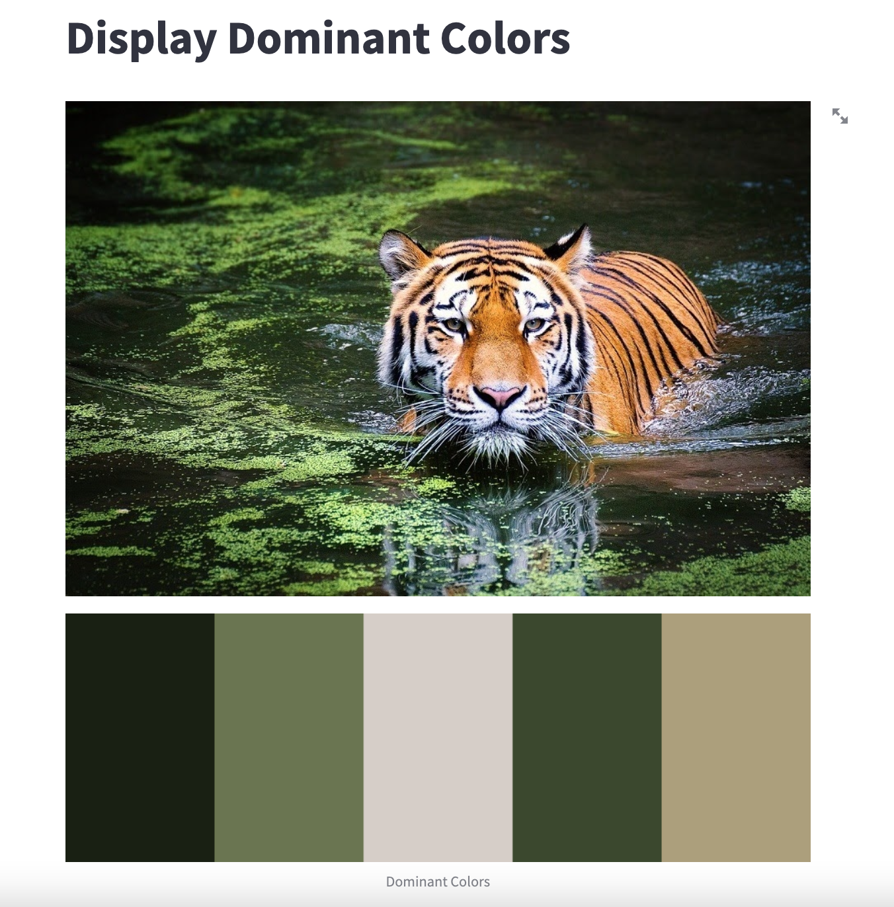

# Finding Dominant Colors in an Image

This project is a simple web application built in Streamlit, designed to display the dominant colors in an image. The default setting is to display 5 dominant colors, which has been determined as an optimal decision through various tests.
The purpose of this project is to provide a quick and intuitive way for users to visualize the dominant colors in an image. Whether for artistic inspiration, color analysis, or any other purpose, this tool aims to simplify the process of identifying the dominant colors in an image.
The algorithm used to determine the dominant colors is k-means clustering. K-means clustering is a popular unsupervised learning algorithm that partitions data into a predetermined number of clusters. In this case, the number of clusters is fixed by default. This decision was made to ensure real-time performance, as other methods of determining the optimal number of clusters may require visualizations or have high computational complexity.

`    Note: The latest version of Streamlit is compatible with the two most recent versions of the following browsers: Google Chrome. Firefox`



1. Check if you have python installed:

```shell
    python --version
```

If not, follow the instructions given here - https://wiki.python.org/moin/BeginnersGuide/Download

2. Install poetry

Follow the instructions given here - https://python-poetry.org

3. Clone the repository:

```shell
    git clone https://github.com/olast45/Find-Dominant-Colors.git
```

4. Navigate to the project directory:

```shell
    cd Find-Dominant-Colors
```

5. Install the required dependencies using Poetry by typing:

```shell
    poetry install
```

6. Activate virtual environment with a following command:

```shell
    poetry shell
```

7. After following the instructions mentioned above you can run the app

```shell
    streamlit run dominant-colors/homepage.py
```
